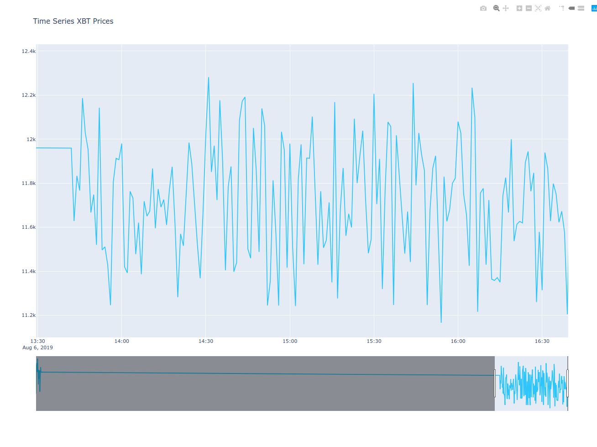
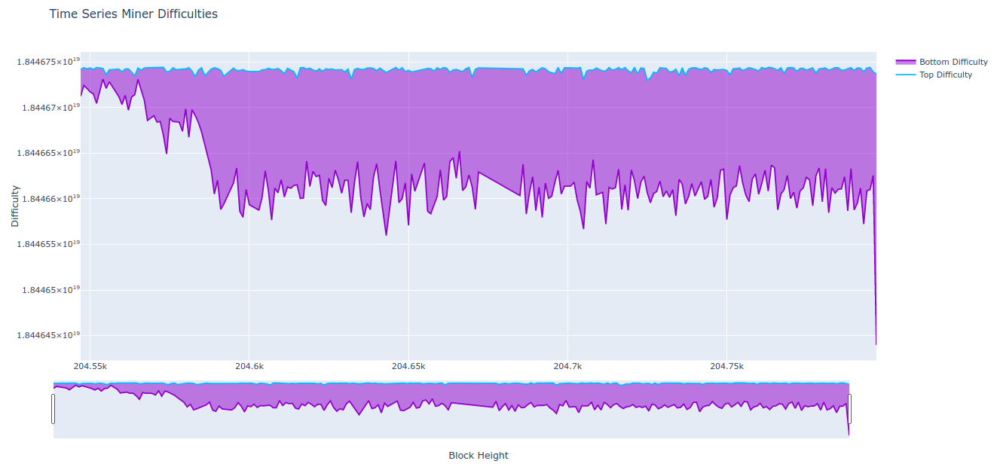

# Alchemy

An alternative utility for interacting with the PegNet.

**Kinda ugly, very alpha. Use at your own risk.**

## Features
- Grades all OPR records and validates factoid burns
- Create burn transactions (FCT --> pFCT)
- Get balances of all assets
- Convert from one asset to another
- Transact assets between addresses
- Graph asset prices per block
- Graph top 50 mining difficulties per block
- Pluggable grading algorithms (and tools to compare across implementations)

## Prerequisites
- Make sure to have a LXR map generated already, it'll take far far too long for the naive python implementation to generate it
- A running factomd node locally with a running PegNet chain
- A running factom-walletd locally (optional: only required if burning factoids)

## Usage
*(Note: all commands currently assume locally running factomd and factom-walletd instances)*
```
$ ./alchemy.py
Usage: alchemy.py [OPTIONS] COMMAND [ARGS]...

Options:
  --help  Show this message and exit.

Commands:
  burn                Burn FCT for pFCT
  convert             Perform a conversion between assets
  get-balances        Get a list of all balances for the given address
  get-rates           Get a list of conversion rates for the given block
  get-sync-head       Get the highest block parsed
  get-winners         Get winning records at the given block height
  graph-difficulties  Graph the range of winning miner difficulties
  graph-prices        Graph the prices of given tickers
  reset               Delete the current alchemy database
  run                 Main entry point for the node
  send                Send a like-kind transaction
```

### Running the Grader
This command will grade all unseen oracle price records and run through all unseen Factoid Blocks looking for burn transactions. Stores results in a database to save progress and make subsequent runs quicker. It will also launch a MessagePack based RPC server for the CLI to utilize

Example:
```
$ ./alchemy.py run

      o       
       o      
     ___      
     | |      
     | |      
     |o|             _      _                          
    .' '.       __ _| | ___| |__   ___ _ __ ___  _   _ 
   /  o  \     / _` | |/ __| '_ \ / _ \ '_ ` _ \| | | |
  :____o__:   | (_| | | (__| | | |  __/ | | | | | |_| |
  '._____.'    \__,_|_|\___|_| |_|\___|_| |_| |_|\__, |
                                                 |___/ 

Executing block 9...
Graded OPR block 9 (winners: ['', '', '', '', '', '', '', '', '', ''])
Parsed factoid block 9 (burns found: 0)

Executing block 10...
Graded OPR block 10 (winners: ['b7471632b9da1511', '599fd1bc18ef8f63', '22d9b7b300350687', '4d5004c4a137b9cb', '839e3452846b1553', '6a22e1e9af2d2cb6', '9781259b254ed211', '8a95fa701573c39b', '619e990b6d6f3aee', '74b40c53231a9c6f'])
Parsed factoid block 10 (burns found: 0)

Executing block 11...
Graded OPR block 11 (winners: ['92dfc51e9e19d804', '3d6b43d1df3e584b', '8cc2818037a89684', 'c0d79d71f3589e78', '737115e100fd29e4', '24ec17cf8d4fcd82', 'c999e5ceffa7def3', '09427764568bf2a7', 'f71390e14f2ec4da', '4fe4ceaaad6b8d4a'])
Parsed factoid block 11 (burns found: 0)
```

### Burning FCT for pFCT
This command will take a given FCT address that you have stored in factom-walletd, and create a transaction of the specified amount to be burned for pFCT.

Example:
```
$ ./alchemy.py burn 30 FA2jK2HcLnRdS94dEcU27rF3meoJfpUcZPSinpb7AwQvPRY6RL1Q

Starting balance: 39809.90816 FCT
Burning 30.0 FCT from FA2jK2HcLnRdS94dEcU27rF3meoJfpUcZPSinpb7AwQvPRY6RL1Q to EC2BURNFCT2PEGNETooo1oooo1oooo1oooo1oooo1oooo19wthin...
TxID: fd9b77c9b25a5b37e0b9f56bc060dc12cd2c6405e3608e8a1cd44b4d8e89ff65
```

Optionally, you can run with `--dry-run` to simply compose the transaction and return without broadcasting it:
```
$ ./alchemy.py burn FA2jK2HcLnRdS94dEcU27rF3meoJfpUcZPSinpb7AwQvPRY6RL1Q 30 --dry-run

Starting balance: 39779.90816 FCT
Burning 30.0 FCT from FA2jK2HcLnRdS94dEcU27rF3meoJfpUcZPSinpb7AwQvPRY6RL1Q to EC2BURNFCT2PEGNETooo1oooo1oooo1oooo1oooo1oooo19wthin...
Tx: {"jsonrpc": "2.0", "id": 15, "params": {"transaction": "02016c40e7777d0100018b96c1bc00646f3e8750c550e4582eca5047546ffef89c13a175985e320232bacac81cc4280037399721298d77984585040ea61055377039a4c3f3e2cd48c46ff643d50fd64f01718b5edd2914acc2e4677f336c1a32736e5e9bde13663e6413894f57ec272e285c500f77e0975099512cc53a27591fa9bc09a7a972d07d645a15034d55361e6ff805da5113bbf604de7cf19f601702c8ca2efad22d18059be72b940679560f0d"}, "method": "factoid-submit"}
The above transaction was not sent.
```


### Checking current balances
```
$ ./alchemy.py get-balances FA2jK2HcLnRdS94dEcU27rF3meoJfpUcZPSinpb7AwQvPRY6RL1Q | jq

{
  "pFCT": 120,
  "FCT": 39779.90816,
  "PNT": 60000,
}
```

### Sending a like-kind transaction

To try out sending a transaction, the `--dry-run` flag will ensure you can view the transaction that will be created, but just don't send it.

```
$ ./alchemy.py send 5000 pFCT FA2jK2HcLnRdS94dEcU27rF3meoJfpUcZPSinpb7AwQvPRY6RL1Q --to 5000 FA1zT4aFpEvcnPqPCigB3fvGu4Q4mTXY22iiuV69DqE1pNhdF2MC --ec-address EC3TsJHUs8bzbbVnratBafub6toRYdgzgbR7kWwCW4tqbmyySRmg --dry-run

External-IDs: ['313536353938323536362e313530323834', '01718b5edd2914acc2e4677f336c1a32736e5e9bde13663e6413894f57ec272e28', '410994cba2844a5b441142612836f0172e7a2fe9d7dc315af03ad6b24f84b8df733e4e6fe572d8447732bbe8a52f9ec67bab4bccfb287d1100ff2d72b5c29d07']
Content: {"transactions":[{"input":{"address":"FA2jK2HcLnRdS94dEcU27rF3meoJfpUcZPSinpb7AwQvPRY6RL1Q","type":"FCT","amount":5000},"outputs":[{"address":"FA1zT4aFpEvcnPqPCigB3fvGu4Q4mTXY22iiuV69DqE1pNhdF2MC","amount":5000}]}]}
The above transaction was not sent.

```

Then re-execute the command without the --dry-run flag in order to actually send it:
```
./alchemy.py send 5000 pFCT FA2jK2HcLnRdS94dEcU27rF3meoJfpUcZPSinpb7AwQvPRY6RL1Q --to 5000 FA1zT4aFpEvcnPqPCigB3fvGu4Q4mTXY22iiuV69DqE1pNhdF2MC --ec-address EC3TsJHUs8bzbbVnratBafub6toRYdgzgbR7kWwCW4tqbmyySRmg

Tx Sent: {'message': 'Entry Reveal Success', 'entryhash': '8bbb628e7318c6a5d07f8cc135ab4d002e1d7965df759b6a4922e5d6a3905a60', 'chainid': '77d4651d899bdff0a8e15515ea49552a530b4657bc198414f555aabcde87e5b0'}

```

### Convert between assets
```
$ ./alchemy.py convert 50000 pFCT FA2jK2HcLnRdS94dEcU27rF3meoJfpUcZPSinpb7AwQvPRY6RL1Q --to 2500 pUSD --to 177 pETH --ec-address EC3TsJHUs8bzbbVnratBafub6toRYdgzgbR7kWwCW4tqbmyySRmg --dry-run

External-IDs: ['313536353938323931382e303637343533', '01718b5edd2914acc2e4677f336c1a32736e5e9bde13663e6413894f57ec272e28', '761288cb01b3238f681f0b665081fb1c1b7bec484a036e3498f0a08d6d64ac2168ff261b46a8d3ee7acb31f7a9c822a98cf29a30a8b5eaa24a4a4a1616f8e800']
Content: {"transactions":[{"input":{"address":"FA2jK2HcLnRdS94dEcU27rF3meoJfpUcZPSinpb7AwQvPRY6RL1Q","type":"FCT","amount":50000},"outputs":[{"address":"FA2jK2HcLnRdS94dEcU27rF3meoJfpUcZPSinpb7AwQvPRY6RL1Q","type":"USD","amount":2500},{"address":"FA2jK2HcLnRdS94dEcU27rF3meoJfpUcZPSinpb7AwQvPRY6RL1Q","type":"ETH","amount":177}]}]}
The above transaction was not sent.
```

```
$ ./alchemy.py convert 50000 pFCT FA2jK2HcLnRdS94dEcU27rF3meoJfpUcZPSinpb7AwQvPRY6RL1Q --to 2500 pUSD --to 177 pETH --ec-address EC3TsJHUs8bzbbVnratBafub6toRYdgzgbR7kWwCW4tqbmyySRmg

Tx Sent: {'message': 'Entry Reveal Success', 'entryhash': '1e419455abd9daa45522ee35a4927a8b729ce20a6d18d744daafa8e0009de306', 'chainid': '77d4651d899bdff0a8e15515ea49552a530b4657bc198414f555aabcde87e5b0'}
```

Now after executing the above conversion, we can check the balances again:
$ ./alchemy.py get-balances FA2jK2HcLnRdS94dEcU27rF3meoJfpUcZPSinpb7AwQvPRY6RL1Q | jq{
  "balances": {
    "PNT": 188500000000000,
    "pFCT": 53499983917,
    "pUSD": 2500,
    "pETH": 177,
    "FCT": 1936499988000
  }
}


### Get conversion rates
```
$ ./alchemy.py get-rates 392 | jq
{
  "rates": {
    "PNT": 0,
    "USD": 1,
    "EUR": 1.1107,
    "JPY": 0.0094,
    "GBP": 1.2086,
    "CAD": 0.751,
    "CHF": 1.0241,
    "INR": 0.014,
    "SGD": 0.7199,
    "CNY": 0.1421,
    "HKD": 0.1275,
    "KRW": 0.0008,
    "BRL": 0.2505,
    "PHP": 0.019,
    "MXN": 0.0509,
    "XAU": 1522.07,
    "XAG": 17.2568,
    "XPD": 1428,
    "XPT": 837,
    "XBT": 10392.3863,
    "ETH": 187.3305,
    "LTC": 76.4788,
    "RVN": 0.0345,
    "XBC": 319.4148,
    "FCT": 3.2186,
    "BNB": 28.1535,
    "XLM": 0.0701,
    "ADA": 0.0476,
    "XMR": 82.0497,
    "DASH": 95.5745,
    "ZEC": 50.5974,
    "DCR": 25.5179
  }
}
```

### Get winning records of a block
Returns a list of entry hashes for the winners of the given block height

Example:
```
$ ./alchemy.py get-winners 76 | jq
{
  "winners": [
    {
      "place": 1,
      "entry_hash": "82426bf90f76c69cdf7d3fb877aed7fd2b5f7c823b400791927827d59a29b2c7"
    },
    {
      "place": 2,
      "entry_hash": "e7b511c78cd080d45e8d3c4bb8e419bcb8d2840bc8d4cb7f41acf9797cea0ece"
    },
    {
      "place": 3,
      "entry_hash": "ae4f73fe65e0a7e8f4cfcec54ea02bbdeff84b50a5fd0d8e748a8d4e24ef7219"
    },
    {
      "place": 4,
      "entry_hash": "547bcd4bfd08468642fa0472cd8f1a244859f74e0288f4354eb444abfd9d6375"
    },
    {
      "place": 5,
      "entry_hash": "3e363b762d258a6dd1b3810ac826fe3a2dca418506f36fcefc6e391cdff816bb"
    },
    {
      "place": 6,
      "entry_hash": "a38ca5cd6cc27db2038f1634f42defe9068727ee780e40df37b74247eaf9d42a"
    },
    {
      "place": 7,
      "entry_hash": "ca8335119520a986ba73fe18ff3d16bbca3772623f0a8a198aaf6f32e7e89096"
    },
    {
      "place": 8,
      "entry_hash": "818b97a31388b9e51d3970cbf8cba934831c4c94eda1c756e92bb08fd87079ad"
    },
    {
      "place": 9,
      "entry_hash": "78fd2d597c9f6bc72b99af2e774753bb900ece7e7ba3defef184dfb0f022e18e"
    },
    {
      "place": 10,
      "entry_hash": "538add19330dfd6e11b622e309bf8c79d14152bc6a57bd798c92dee48f841200"
    }
  ]
}
```

### Graphing Asset Prices
Basic time-series graphs for a given asset is supported with the `./alchemy.py graph-prices -t TICKER [--by-height]` command.

Example:
```
$ ./alchemy.py graph-prices -t XBT
Done. A browser window should open shortly.
```



Other options include:
- Graphing all assets with: `$ ./alchemy.py graph-prices`
- Graphing a set of assets with `$ ./alchemy.py graph-prices -t XBT -t FCT`

### Graphing Winning Miner Difficulty Ranges
Basic time-series graph for the range of winning mining difficulties `./alchemy.py graph-difficulties [--by-height]`


